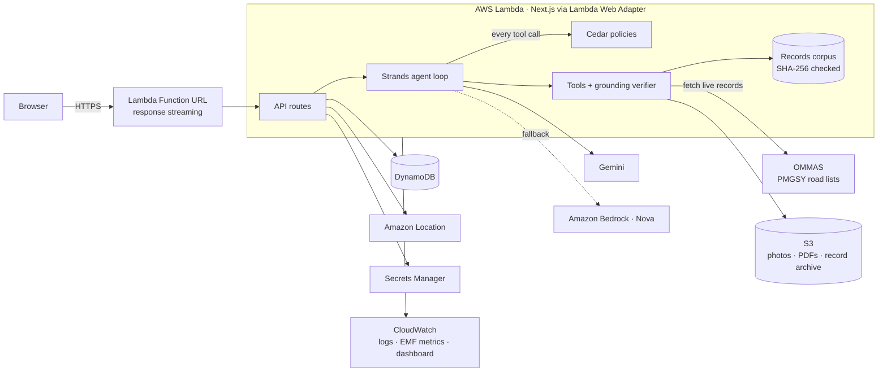

# CivicProof

**From a civic complaint to an evidence-backed case.**

Report a damaged road. CivicProof finds the public-works project at that spot, reads the official records, checks every fact against the page it came from, and drafts a neutral complaint, or an RTI application for whatever the records leave out. Then it tracks the reply.

Built for **First Commit** (WeMakeDevs × AWS, 17–20 Sep 2026).


---

## Screenshots

| | |
|---|---|
|  |  |
|  |  |
|  |  |
|  |  |

## The problem

Reporting a pothole is easy. Proving who owes the repair is not.

The facts that make a complaint hard to ignore are public, but scattered and hard to find: a tender on the state procurement portal, an award record in its API, a completion date in a scheme database, a five-year maintenance clause on page 56 of a bid document. Most complaint channels capture a photo and stop. Procurement portals start from the contract and assume you already know which one you want.

And naming a contractor wrongly is worse than not naming one: a Bengaluru road-contracts site was taken offline in September 2026 after its scraper attached contractor names to the wrong tenders.

## What CivicProof does

1. **Report**: a photo, a pin, a date. EXIF location and capture time are read in the browser; the file is fingerprinted with SHA-256. No account needed.
2. **Locate**: the pin is matched against the alignments of public-works projects (official PMGSY GIS where it exists; clearly labelled OpenStreetMap traces where it doesn't). Near-ties are shown, not hidden.
3. **Verify**: an agent reads the tender, award and completion records and records each fact *with a quotation*. A deterministic verifier checks the quotation against the document text and the value against the quotation. Anything it can't find is stored as **unverified**; disagreements are shown as **conflicts**.
4. **Act**: next steps are derived only from verified facts: a repair request under the defect-liability period if the observation falls inside it, a complaint to the right office, and an RTI application listing exactly the records that are missing, kept to one subject and within the 150 words Karnataka's RTI rules ordinarily allow (rule 14); records that don't fit are listed for a second application. Packets are editable and download as PDF.
5. **Track**: the reporter records where they sent it, the reference number and any reply. For an RTI application the case shows the statutory clock: reply due in 30 days (Section 7(1)); if none is recorded, a deemed refusal (Section 7(2)) and a drafted **first appeal** under Section 19(1), asking for the information free of charge (Section 7(6)).

6. **Close the loop**: when the RTI reply arrives, the reporter adds it to the case. The file stays private; its text is extracted and the investigator can read and quote it on the next run, with quotes marked as coming from the reporter's upload.

What it deliberately does **not** do: accuse anyone, invent a tender number, submit anything on your behalf, or mark a case resolved. The last is enforced by a Cedar policy, not by a prompt.

### Who it is for

Residents and resident welfare associations, ward volunteers, local journalists and civic groups who already file complaints and RTIs, and who lose hours working out *which* office, *which* contract and *which* record to ask for.

## What is real here

| | Status |
|---|---|
| Official records | **Real.** 26 public documents (853 pages) covering 779 public-works projects in and around Bengaluru, plus BBMP's 4,729 work orders and payments for 2025-26 (via OpenCity, public domain): OMMAS road lists for Bengaluru Rural, Ramanagara, Chikkaballapura, Kolar and Tumakuru (PMGSY-I, II and III) and Bengaluru Urban (PMGSY-III), with quality grades for Bengaluru Urban and Rural; the PMGSY Programme Guidelines; BBMP white-topping tender, award and tender records from the Karnataka Public Procurement Portal's public API; a Bengaluru Smart City status presentation; and CAG Report No. 11 of 2025. Each stored with URL, retrieval date and SHA-256. |
| Reference facts | **Real, and re-verified on every build.** 7,622 facts, each a verbatim quotation checked by `npm run ingest`: 85 curated by hand, the rest extracted row by row from the OMMAS exports by `scripts/import-ommas.mts`, which keeps only facts the app's own verifier accepts. |
| Project locations | PMGSY-III roads: official GeoSadak GIS (128 roads). City roads: traced from OpenStreetMap by road name and labelled approximate. Older PMGSY roads have no published map line: they are found by name. |
| Live records | The investigator can **search and fetch records from the government's PMGSY portal (OMMAS) at run time**, for any Karnataka district. Each fetched record is archived with its URL, retrieval time and SHA-256, and quoted and verified like the bundled ones. |
| Demo reports | **Illustrative.** Six seeded reports show the workflow. They are marked "Demo report" everywhere; nobody filed them anywhere. |
| AI investigation | Real Strands agent + Cedar + verifier. With a Gemini key it runs **Google Gemini** (tested live: on the Kodathi road it linked the right project and verified the contractor, work order date, 5-year maintenance period and costs from the OMMAS pages); on AWS it can run a model on **Amazon Bedrock** instead. With neither, a **rules planner** drives the same tools by replaying curated extractions, and the UI says so. |

Details: [docs/DATA_SOURCES.md](docs/DATA_SOURCES.md).

## Why AI, and where it stops

The hard part is reading: 65-page bid documents, scheme reports whose tables extract as jumbled rows, portal JSON with epoch timestamps. A language model is good at finding the page and the words. It is not trustworthy as a source of facts. So:

- **The model proposes; code verifies.** Every factual claim must quote its page. `src/lib/agent/verifier.ts` normalises the text (whitespace, dashes, ₹, Indian number formats) and accepts a claim only if the quotation is on the page *and* the value is in the quotation (₹1.25 crore = Rs. 125.00 lakhs; 31.03.2025 = 31 March 2025; 5-year = 60 months).
- **Cedar governs the agent.** `policies/agent-tools.cedar` is evaluated before every tool call: only projects the location search returned can be selected, official-record claims must carry citations, search radius and per-run budgets are capped, and anything unlisted is denied.
- **Neutral language is enforced.** A Strands intervention stops accusatory wording ("fraud", "corruption"…) in the model's findings and asks it to rephrase.
- **Actions are rules, not vibes.** Next steps and packets are assembled deterministically from verified facts. The model can suggest an extra action; it is labelled "AI suggestion".

> **What re-verification depends on.** That guarantee holds for a checkout that has the source documents. **6,826 of the 7,622 facts (89.6%) cite one of the 18 OMMAS documents whose licence restricts republication**, so how this repository is released decides whether a fresh clone can re-verify them. `npm run ingest` is explicit about it: a source that is absent is named, the facts citing it fail to verify rather than being assumed good, and the build stops. See [docs/PUBLIC_RELEASE.md](docs/PUBLIC_RELEASE.md).

## How a report becomes a determination

1. **A report** — a pin, a photograph, a description, and optionally the work number printed on the project board.
2. **Identity, identifier-first.** A work number is looked up *exactly* in a registry index built from the corpus (778 of 779 projects carry one). Normalisation fixes case and separators but never guesses between look-alike characters, and there is no fuzzy matching. A code that matches several projects — 53 of them do; `KN0204` matches 13 — yields `CODE_MATCHES_MULTIPLE_PROJECTS` and a person chooses. With no code, the location only *suggests* candidates: identity is established only once the project's own `project_id` is confirmed word for word in a document from that project's own bundle. Otherwise the project is **UNVERIFIED**, and the case does not advance, the complaint does not name a project, and no repair request is raised.
3. **Records and facts.** The agent reads the project's documents and proposes claims; the deterministic verifier accepts one only if the quotation is on the cited page and contains the stated value.
4. **Conflicts and units.** Values normalise into typed quantities (kind + magnitude in one canonical unit), so `12 months` and `1 year` are one fact while `12.5 million` and `12.5 crore` are a conflict that gets surfaced. A figure with no unit is its own kind and can never pass as a cost.
5. **The defect-liability window** is arithmetic over a *physical* completion date and a stated period — resolved by the nearest label in the source, never by position, and UNKNOWN when the labels do not settle it. A model-authored window is discarded outright.
6. **Four determinations**, each standing alone and each derived by plain code:

   | | |
   |---|---|
   | **Identity** | VERIFIED · UNVERIFIED · CODE_MATCHES_MULTIPLE_PROJECTS |
   | **Contractual status** | ACTIVE · EXPIRED · UNKNOWN (as of today; whether the *observation* fell inside the window is recorded separately) |
   | **Field condition** | DEFECT_OBSERVED · NO_DEFECT_OBSERVED · INSUFFICIENT_EVIDENCE · HUMAN_REVIEW |
   | **Scope relationship** | POTENTIALLY_RELATED · NOT_ESTABLISHED · UNKNOWN |

7. **An overall state** — SUPPORTED, POTENTIAL_ISSUE, UNKNOWN or UNVERIFIED — is an ordered rule table over those three, total across all 108 combinations and asserted as such in `tests/determination.test.ts`. `POTENTIAL_ISSUE` and `HUMAN_REVIEW` both route to a person.
8. **Evidence completeness** is shown as *N of 7 records we check for*. It is a checklist count, **not** a confidence or truth score, and it is labelled that way in the UI.

### Where the system stops

CivicProof establishes what the records support. It does not decide who is responsible. No determination, complaint or packet asserts that a contractor caused a defect, is at fault, was negligent or is liable — a test asserts that none of the 108 outcomes contains such language. An open maintenance period is a fact about a contract, and the product says so in those words and no stronger.

## Why AWS

Each service does a job the product needs; none is there for show.

| Service | Role |
|---|---|
| **Amazon Bedrock (Amazon Nova)** | When Gemini runs out of quota or stays overloaded, the investigation **continues on Nova mid-run**, keeping the project it selected and the facts it verified. With `Planner=bedrock`, Nova runs the whole investigation. |
| **Strands Agents** (AWS open source) | The agent loop, the Gemini and Bedrock model providers, retries, lifecycle hooks and the Cedar intervention. |
| **Cedar** (AWS open source) | Two policy sets: every agent tool call (including which live records it may fetch, and how many), and every change to a case. |
| **AWS Lambda** | Next.js standalone server behind a **Function URL in response-streaming mode**, via the Lambda Web Adapter, so the agent's steps stream to the browser live. |
| **Amazon S3** | Report photos, packet PDFs, and the **archive of public records the agent fetches live**, each stored with its URL, retrieval time and SHA-256 so a citation keeps pointing at the same bytes. Private, SSE, TLS-only. |
| **Amazon Textract** | OCR for scanned uploads (RTI replies usually come back as scanned letters), so the investigator can quote them. |
| **Amazon Location Service** | Address search on the report form, and the **road name at a report's pin**, which is how government records identify places. |
| **Amazon DynamoDB** | Cases (single table, optimistic locking), daily investigation budget counters with TTL. |
| **AWS Secrets Manager** | The Gemini API key; the function's role can read that one secret and nothing else. |
| **Amazon CloudWatch** | Structured logs; **per-run metrics in Embedded Metric Format** (share of the model's claims the verifier accepted, policy denials, conflicts, model waits, duration, tokens); a dashboard and an error alarm. |
| **AWS SAM** | One template (`infra/template.yaml`) with least-privilege IAM. |



More: [docs/ARCHITECTURE.md](docs/ARCHITECTURE.md) · [docs/AGENT.md](docs/AGENT.md) · [docs/SECURITY.md](docs/SECURITY.md)

## Run it locally

Requirements: Node.js 22+ (developed on 24).

```bash
npm install
npm run ingest      # extract page text, check SHA-256s, re-verify all curated quotations
npm run seed        # six labelled demo reports (local JSON store)
npm run dev         # http://localhost:3000
```

That's the whole setup: no AWS account, no API keys. Investigations then use the rules planner, which only replays curated extractions for the 8 known projects.

**With Gemini (the real investigator)**, put a key from [Google AI Studio](https://aistudio.google.com/apikey) in `.env.local` and restart:

```bash
echo 'GEMINI_API_KEY=your-key' > .env.local   # gitignored; read only on the server
npm run dev
```

The free tier allows about 20 requests per model per day and a few per minute; an investigation makes 10–15, so expect about one or two runs per model per day, with pauses the live trace shows. Enable billing on the key's project for a public demo. `GEMINI_MODEL_ID` picks the model (default `gemini-3-flash-preview`).

**With a model on Bedrock**, give the process AWS credentials that can invoke the model (or a Bedrock API key) and switch the planner:

```bash
export AWS_REGION=ap-south-1
export CIVICPROOF_PLANNER=bedrock
export BEDROCK_MODEL_ID=apac.amazon.nova-pro-v1:0   # the default; any Bedrock model with tool use works
npm run dev
```

See [.env.example](.env.example) for every setting.

## Test

```bash
npm test            # 155 unit/integration tests (Vitest)
npm run test:e2e    # 5 browser tests incl. an axe WCAG 2.1 AA audit (Playwright), against a running server
                    # (they create cases: run that server with CIVICPROOF_PLANNER=rules and CIVICPROOF_DATA_DIR
                    #  pointing at a scratch dir you've seeded, so they neither spend model quota nor touch .data)
npm run check       # all of the above plus types and lint
npm run eval        # replays every *mapped* project's reference facts through the real pipeline and
                    # fails below its thresholds. It prints its own denominators: 130 of 779 projects
                    # and 1,317 of 7,622 facts. With no GEMINI_API_KEY it is a deterministic replay —
                    # a corpus-integrity check, not a measure of model accuracy.
npm run typecheck
npm run lint
```

The suites cover the verifier (amounts, dates, durations, fabricated citations, conflicts), both Cedar policy files, the full investigation pipeline on real records, the **Gemini and Bedrock code paths** (each against a local stand-in for its API that deliberately hallucinates, accuses and oversteps, and is caught each time), the DynamoDB store against `dynalite` (including concurrent writers), the RTI clock and first appeal, private reporter uploads, OCR through a local Textract stand-in, the browser flows from report to packet and from RTI reply to evidence, and an axe accessibility audit of every main page (no WCAG 2.1 A/AA violations).

## Deploy to AWS

Requirements: AWS CLI and SAM CLI, credentials for an account with Amazon Bedrock model access in your region.

```bash
./scripts/deploy.sh
```

This builds the Next.js standalone server into `.lambda/`, validates `infra/template.yaml`, runs `sam deploy` (guided the first time), seeds the demo reports into DynamoDB and prints the URL. If `.env.local` has a `GEMINI_API_KEY`, it is passed as a NoEcho parameter into the function's environment. Parameters: `Planner` (`gemini`|`bedrock`|`rules`), `GeminiModelId`, `BedrockModelId`, `MaxRunsPerDay`, `MaxRunsPerCase`. Details and teardown: [docs/DEPLOY.md](docs/DEPLOY.md).

## Project layout

```
src/lib/agent/      tools, rules planner, verifier, guards, finalize, orchestrator (Strands + Cedar)
src/lib/            schemas (Zod), case service, packets, PDF, storage (local/DynamoDB, local/S3), authz
src/app/            pages (report, cases, case dossier, packet editor, records, projects, method) and API routes
policies/           Cedar policies for the agent and for case actions
corpus/             manifest, curated project records, authorities, source documents, geometry
infra/              AWS SAM template
scripts/            ingest, seed, geometry build, Lambda packaging, deploy
tests/              Vitest suites and Playwright e2e
docs/               architecture, agent, data sources, security, deploy, demo script, research
```

## Known limitations

- City coverage is thin: two city road packages have records; the other 777 projects are rural PMGSY roads around Bengaluru. A report nothing matches gets an honest "not found" and an RTI draft to identify the responsible office.
- Live search covers OMMAS only. The Karnataka procurement portal's tender search sits behind a captcha, which CivicProof does not bypass; BBMP's works-bill public view returned errors when this was built.
- City road alignments are approximate; the tenders' key maps have not been digitised.
- PMGSY maintenance windows use the programme guideline's 5-year rule and the recorded completion date; individual contracts were not available.
- Submission is manual: there is no supported government API to file into, so CivicProof drafts and tracks.
- Scanned uploads are OCR'd with Amazon Textract on AWS; locally (no AWS) they are stored but can't be quoted. Scanned documents in the shared corpus are not OCR'd.
- No accounts: an owner key in the browser proves you filed a report.
- Real model runs are only as good as the model's reading: in live Gemini runs it has recorded a financial completion date as the completion date, and dropped units to pass the verifier. Both are now handled in code (field guide, unit notes read from the cited page, deterministic clean-up), but a model can still miss facts the rules planner's curated extractions contain.
- On Gemini's free tier, runs pause for rate limits and fail cleanly when the daily quota or Google's capacity runs out.
- **The evaluation covers a subset, and says so.** `npm run eval` probes each project with a synthetic pin, which only works where a project has a mapped alignment: **130 of 779 projects and 1,317 of 7,622 facts**. With no model key it is a deterministic replay of curated extractions through the real pipeline — a corpus-integrity and plumbing check, not a measure of model accuracy. There is no whole-corpus accuracy figure, and none is claimed.
- **The photograph gate checks technical usability, not image quality.** A photograph must exist, decode, clear a resolution floor and not be trivially small. It is not blur, exposure or content analysis, and it does not judge whether the right thing was photographed. What it does guarantee is direction: an image the deterministic check rejects can never be talked into sufficiency by a model.
- **Without a vision model the field condition is INSUFFICIENT_EVIDENCE**, so `DEFECT_OBSERVED` — and therefore `POTENTIAL_ISSUE` — is only reachable with a model configured, or through the clearly-labelled demo fixture the seed creates. That fixture's image is generated noise, not a photograph, and its observation is marked a demo fixture; it is stored as an unverified AI-origin claim and can never become a verified fact or enter a complaint.
- **The OMMAS exports carry a redistribution restriction.** NRIDA's notice restricts republishing its reports, which is why the repository's publication status is handled deliberately rather than by default; see `docs/PUBLIC_RELEASE.md`. Contractors' phone numbers have been removed from the committed BBMP and KPPP sources, and no reference fact cites the BBMP work-order dataset.

## What's next

1. More live sources for the investigator (the procurement portals of other states, CPPP) behind the same archive, verifier and Cedar budget.
2. Table-aware extraction (Textract `AnalyzeDocument` tables) for measurement books and bills of quantities.
3. Digitise tender key maps so city projects get exact reaches.
4. Group nearby reports into one case, and report outcomes (fix rate), not just counts.
5. Amazon Cognito accounts for organisations, and RTI deadline reminders with EventBridge Scheduler and web push to the installed app.

## AI tools used

Built with Claude Code (Anthropic) as a coding assistant, as permitted by the event rules. The app itself calls Google Gemini (or, if configured, a model on Amazon Bedrock).

## Credits and licence

Code: MIT (see [LICENSE](LICENSE)). Documents and map data remain under their publishers' terms. See [CREDITS.md](CREDITS.md).
