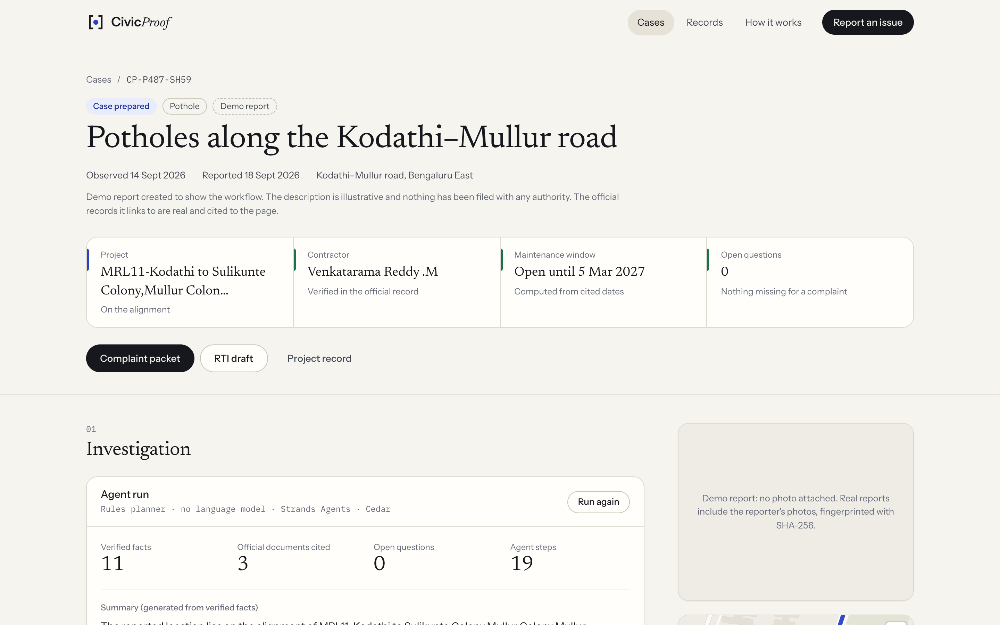
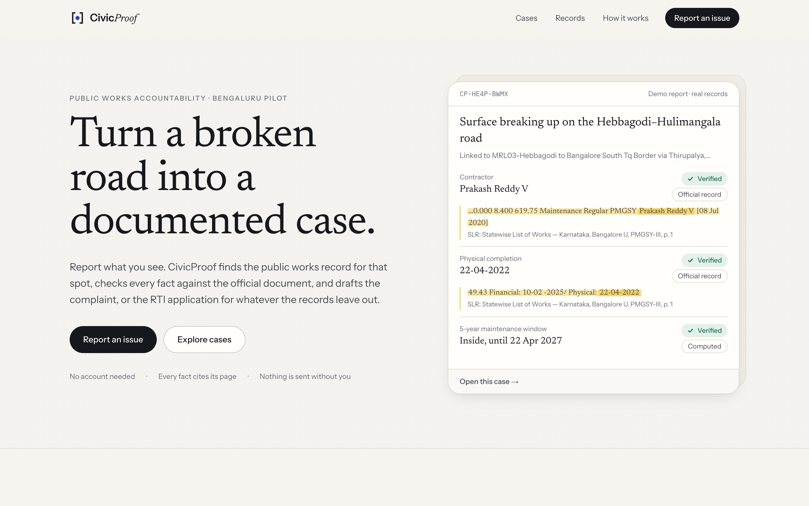
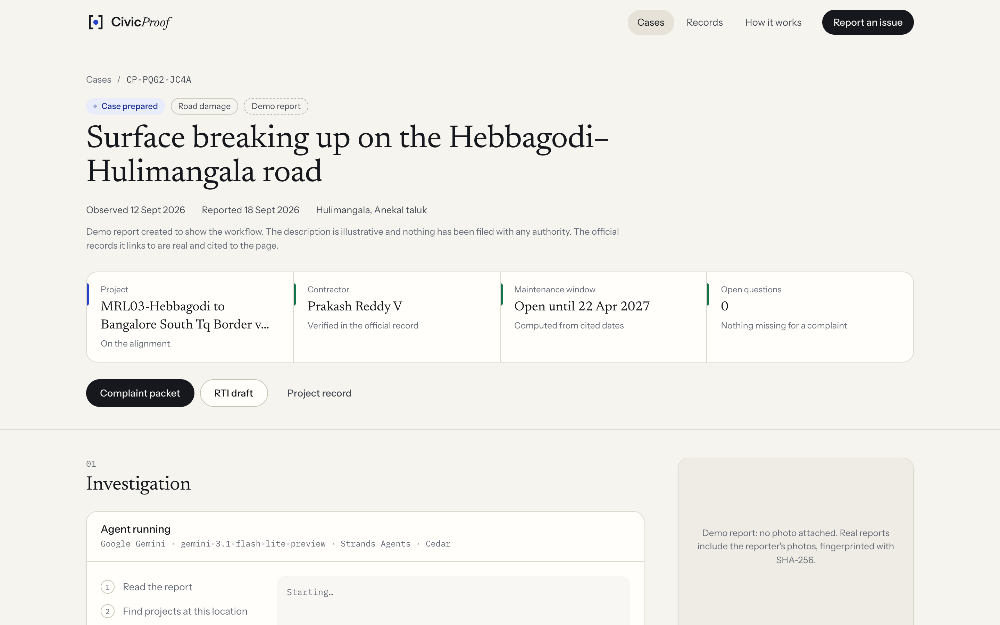
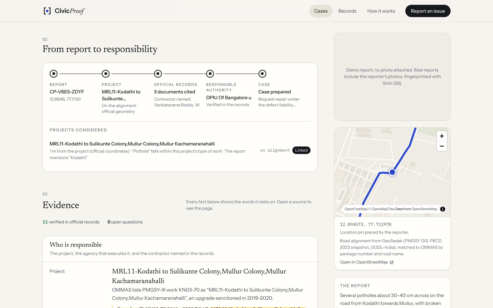
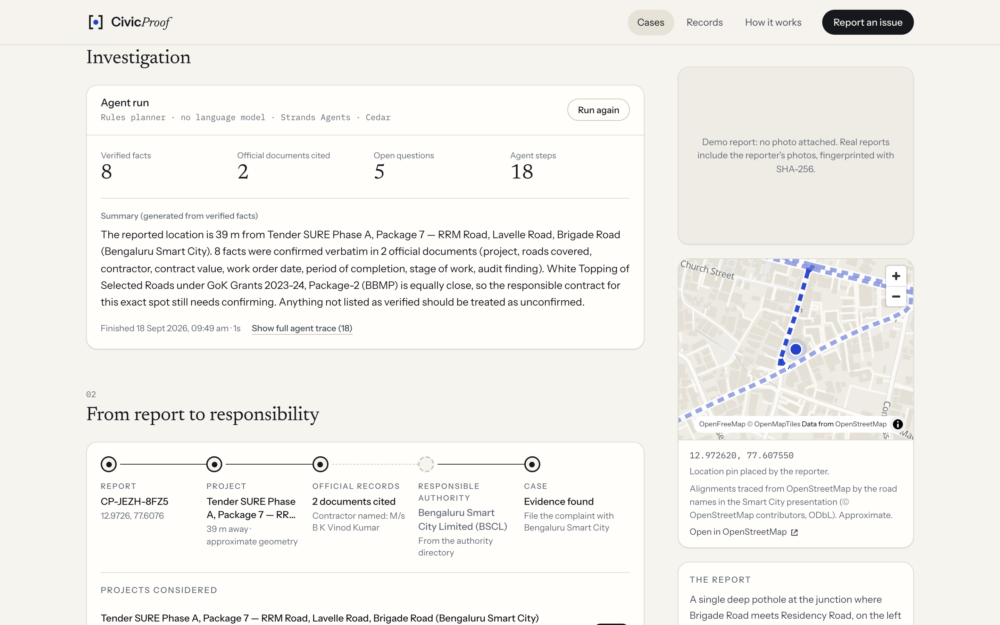
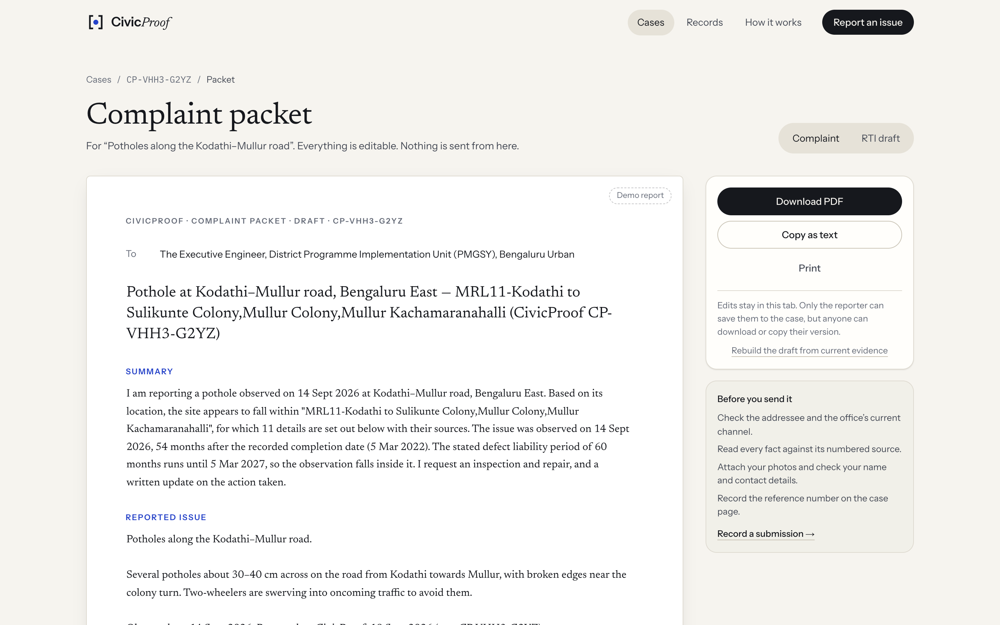
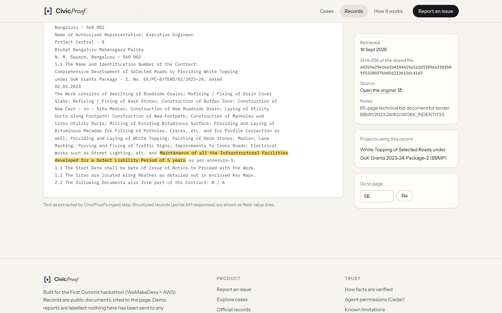
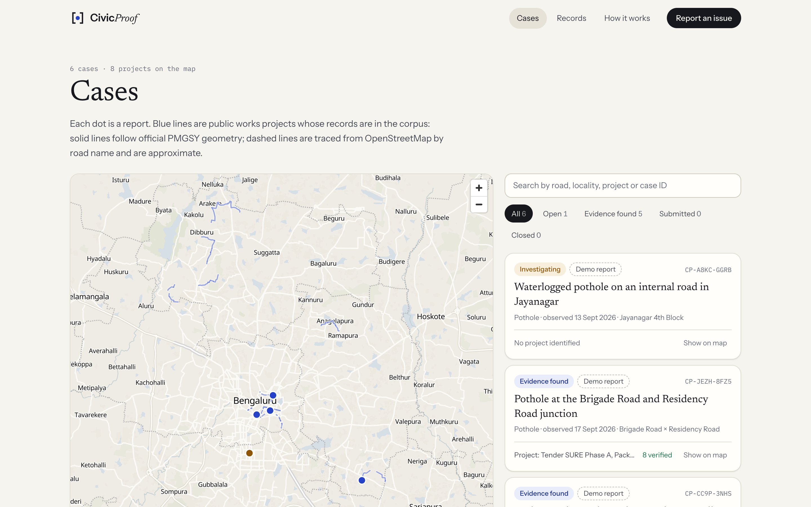
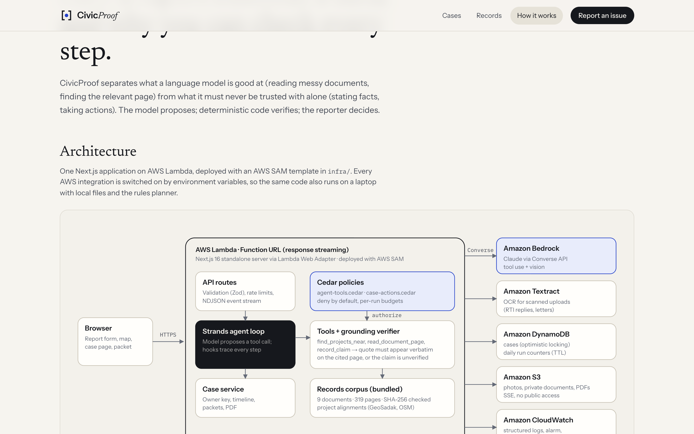
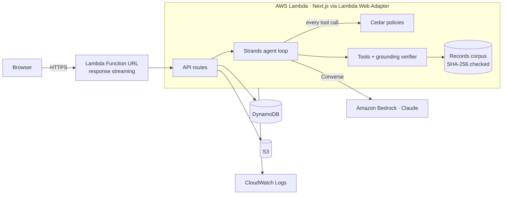

# CivicProof

**From a civic complaint to an evidence-backed case.**

Report a damaged road. CivicProof finds the public-works project at that spot, reads the official records, checks every fact against the page it came from, and drafts a neutral complaint, or an RTI application for whatever the records leave out. Then it tracks the reply.

Built for **First Commit** (WeMakeDevs × AWS, 17–20 Sep 2026).



---

## Screenshots

| | |
|---|---|
|  |  |
|  |  |
|  |  |
|  |  |

## The problem

Reporting a pothole is easy. Proving who owes the repair is not.

The facts that make a complaint hard to ignore are public, but scattered and hard to find: a tender on the state procurement portal, an award record in its API, a completion date in a scheme database, a five-year maintenance clause on page 56 of a bid document. Most complaint channels capture a photo and stop. Procurement portals start from the contract and assume you already know which one you want.

And naming a contractor wrongly is worse than not naming one: a Bengaluru road-contracts site was taken offline in September 2026 after its scraper attached contractor names to the wrong tenders.

## What CivicProof does

1. **Report**: a photo, a pin, a date. EXIF location and capture time are read in the browser; the file is fingerprinted with SHA-256. No account needed.
2. **Locate**: the pin is matched against the alignments of public-works projects (official PMGSY GIS where it exists; clearly labelled OpenStreetMap traces where it doesn't). Near-ties are shown, not hidden.
3. **Verify**: an agent reads the tender, award and completion records and records each fact *with a quotation*. A deterministic verifier checks the quotation against the document text and the value against the quotation. Anything it can't find is stored as **unverified**; disagreements are shown as **conflicts**.
4. **Act**: next steps are derived only from verified facts: a repair request under the defect-liability period if the observation falls inside it, a complaint to the right office, and an RTI application listing exactly the records that are missing. Packets are editable and download as PDF.
5. **Track**: the reporter records where they sent it, the reference number and any reply. For an RTI application the case shows the statutory clock: reply due in 30 days (Section 7(1)); if none is recorded, a deemed refusal (Section 7(2)) and a drafted **first appeal** under Section 19(1), asking for the information free of charge (Section 7(6)).

6. **Close the loop**: when the RTI reply arrives, the reporter adds it to the case. The file stays private; its text is extracted and the investigator can read and quote it on the next run, with quotes marked as coming from the reporter's upload.

What it deliberately does **not** do: accuse anyone, invent a tender number, submit anything on your behalf, or mark a case resolved. The last is enforced by a Cedar policy, not by a prompt.

### Who it is for

Residents and resident welfare associations, ward volunteers, local journalists and civic groups who already file complaints and RTIs, and who lose hours working out *which* office, *which* contract and *which* record to ask for.

## What is real here

| | Status |
|---|---|
| Official records | **Real.** 9 public documents (319 pages) for 8 Bengaluru road projects: OMMAS PMGSY-III road list and quality grades, PMGSY Programme Guidelines, BBMP white-topping tender, award and tender records from the Karnataka Public Procurement Portal's public API, a Bengaluru Smart City status presentation, and CAG Report No. 11 of 2025. Each stored with URL, retrieval date and SHA-256. |
| Curated facts | **Real, and re-verified on every build.** 85 facts, each a verbatim quotation checked by `npm run ingest`. |
| Project locations | PMGSY roads: official GeoSadak GIS. City roads: traced from OpenStreetMap by road name and labelled approximate. |
| Demo reports | **Illustrative.** Six seeded reports show the workflow. They are marked "Demo report" everywhere; nobody filed them anywhere. |
| AI investigation | Real Strands agent + Cedar + verifier. With AWS credentials it runs **Claude on Amazon Bedrock**; without them, a **rules planner** drives the same tools with curated extractions, and the UI says so. |

Details: [docs/DATA_SOURCES.md](docs/DATA_SOURCES.md).

## Why AI, and where it stops

The hard part is reading: 65-page bid documents, scheme reports whose tables extract as jumbled rows, portal JSON with epoch timestamps. A language model is good at finding the page and the words. It is not trustworthy as a source of facts. So:

- **The model proposes; code verifies.** Every factual claim must quote its page. `src/lib/agent/verifier.ts` normalises the text (whitespace, dashes, ₹, Indian number formats) and accepts a claim only if the quotation is on the page *and* the value is in the quotation (₹1.25 crore = Rs. 125.00 lakhs; 31.03.2025 = 31 March 2025; 5-year = 60 months).
- **Cedar governs the agent.** `policies/agent-tools.cedar` is evaluated before every tool call: only projects the location search returned can be selected, official-record claims must carry citations, search radius and per-run budgets are capped, and anything unlisted is denied.
- **Neutral language is enforced.** A Strands intervention stops accusatory wording ("fraud", "corruption"…) in the model's findings and asks it to rephrase.
- **Actions are rules, not vibes.** Next steps and packets are assembled deterministically from verified facts. The model can suggest an extra action; it is labelled "AI suggestion".

## Why AWS

| Service | Role |
|---|---|
| **Amazon Bedrock** | Claude (default `global.anthropic.claude-opus-5`) via the Converse API: tool use for the investigation, vision for describing the photo. Optional Bedrock Guardrail. |
| **Strands Agents** (AWS open source) | The agent loop, Bedrock provider, lifecycle hooks and the Cedar intervention. |
| **Cedar** (AWS open source) | Two policy sets: agent tool calls, and every change to a case. |
| **AWS Lambda** | Next.js standalone server behind a **Function URL in response-streaming mode**, via the Lambda Web Adapter, so the agent's steps stream to the browser live. |
| **Amazon Textract** | OCR for scanned uploads (RTI replies usually come back as scanned letters), so the investigator can quote them. |
| **Amazon DynamoDB** | Cases (single table, optimistic locking), daily investigation budget counters with TTL. |
| **Amazon S3** | Report photos and every generated packet PDF, private, SSE, TLS-only. |
| **Amazon CloudWatch** | Structured JSON logs, an error alarm, and metric filters for failed and budget-denied investigations. |
| **AWS SAM** | One template (`infra/template.yaml`) with least-privilege IAM. |



More: [docs/ARCHITECTURE.md](docs/ARCHITECTURE.md) · [docs/AGENT.md](docs/AGENT.md) · [docs/SECURITY.md](docs/SECURITY.md)

## Run it locally

Requirements: Node.js 22+ (developed on 24).

```bash
npm install
npm run ingest      # extract page text, check SHA-256s, re-verify all curated quotations
npm run seed        # six labelled demo reports (local JSON store)
npm run dev         # http://localhost:3000
```

That's the whole setup: no AWS account, no API keys. Investigations use the rules planner.

**With Claude on Bedrock locally**, give the process AWS credentials that can invoke the model (or a Bedrock API key) and switch the planner:

```bash
export AWS_REGION=ap-south-1
export CIVICPROOF_PLANNER=bedrock
export BEDROCK_MODEL_ID=global.anthropic.claude-opus-5   # or another Claude model / inference profile you have access to
npm run dev
```

See [.env.example](.env.example) for every setting.

## Test

```bash
npm test            # 41 unit/integration tests (Vitest)
npm run test:e2e    # 3 browser tests (Playwright), against a running server: BASE_URL=http://localhost:3000
npm run eval        # scores the investigator against the 85 curated facts (set CIVICPROOF_PLANNER=bedrock to evaluate Claude)
npm run typecheck
npm run lint
```

The suites cover the verifier (amounts, dates, durations, fabricated citations, conflicts), both Cedar policy files, the full investigation pipeline on real records, the **Bedrock code path through the Converse API** (against a local stand-in that deliberately hallucinates, accuses and oversteps, and is caught each time), the DynamoDB store against `dynalite` (including concurrent writers), the RTI clock and first appeal, private reporter uploads, and the browser flows from report to packet and from RTI reply to evidence.

## Deploy to AWS

Requirements: AWS CLI and SAM CLI, credentials for an account with Amazon Bedrock model access in your region.

```bash
./scripts/deploy.sh
```

This builds the Next.js standalone server into `.lambda/`, validates `infra/template.yaml`, runs `sam deploy` (guided the first time), seeds the demo reports into DynamoDB and prints the URL. Parameters: `Planner` (`bedrock`|`rules`), `BedrockModelId`, `MaxRunsPerDay`, `MaxRunsPerCase`. Details and teardown: [docs/DEPLOY.md](docs/DEPLOY.md).

## Project layout

```
src/lib/agent/      tools, rules planner, verifier, guards, finalize, orchestrator (Strands + Cedar)
src/lib/            schemas (Zod), case service, packets, PDF, storage (local/DynamoDB, local/S3), authz
src/app/            pages (report, cases, case dossier, packet editor, records, projects, method) and API routes
policies/           Cedar policies for the agent and for case actions
corpus/             manifest, curated project records, authorities, source documents, geometry
infra/              AWS SAM template
scripts/            ingest, seed, geometry build, Lambda packaging, deploy
tests/              Vitest suites and Playwright e2e
docs/               architecture, agent, data sources, security, deploy, demo script, research
```

## Known limitations

- The corpus is small and hand-assembled (8 projects). A report with no project nearby gets an honest "not found" and an RTI draft to identify the responsible office.
- City road alignments are approximate; the tenders' key maps have not been digitised.
- PMGSY maintenance windows use the programme guideline's 5-year rule and the recorded completion date; individual contracts were not available.
- Submission is manual: there is no supported government API to file into, so CivicProof drafts and tracks.
- Scanned uploads are OCR'd with Amazon Textract on AWS; locally (no AWS) they are stored but can't be quoted. Scanned documents in the shared corpus are not OCR'd.
- No accounts: an owner key in the browser proves you filed a report.

## What's next

1. Ingest more cities and sources automatically (KPPP awarded-works API, OMMAS exports) with the same quote-verification gate.
2. Table-aware extraction (Textract `AnalyzeDocument` tables) for measurement books and bills of quantities.
3. Digitise tender key maps so city projects get exact reaches.
4. Group nearby reports into one case, and report outcomes (fix rate), not just counts.
5. Amazon Cognito accounts for organisations, and Amazon Location Service for geocoding.

## AI tools used

Built with Claude Code (Anthropic) as a coding assistant, as permitted by the event rules. The app itself calls Claude on Amazon Bedrock.

## Credits and licence

Code: MIT (see [LICENSE](LICENSE)). Documents and map data remain under their publishers' terms. See [CREDITS.md](CREDITS.md).
